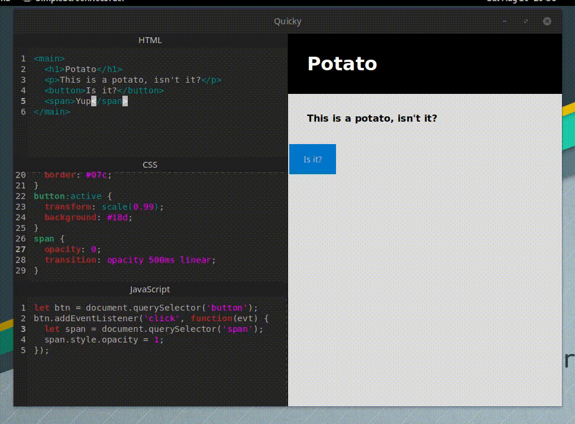

# Quickly

**WIP**.

<figure>
  
  <figcaption>A terribly rendered gif of Quickly in action</figcaption>
</figure>

## Credits
Quickly is essentially a modified version of the commonmark markdown editor built in the [gtk-rs tutorials](https://mmstick.github.io/gtkrs-tutorials/introduction.html) created by [Michael Murphy](https://github.com/mmstick).
